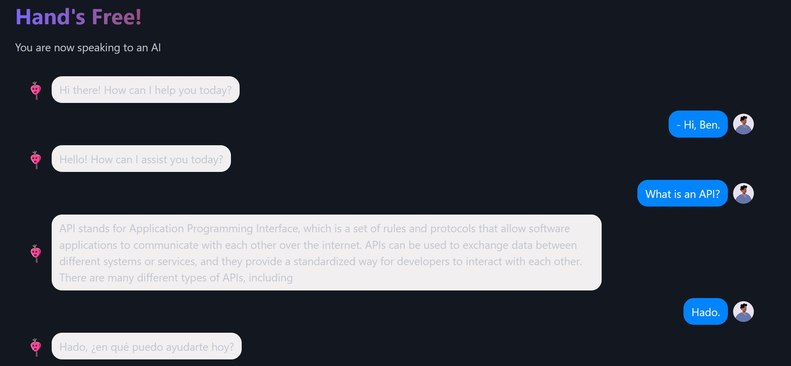
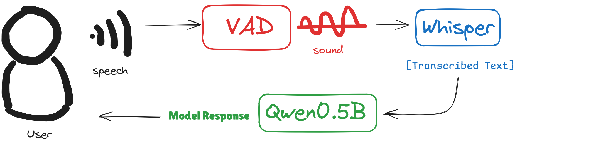

# Hands-Free

Chat hands-free with AI-agent right in your browser.

Try out Live: [rahuldshetty.github.io/hands-free](https://rahuldshetty.github.io/hands-free)

https://github.com/user-attachments/assets/37868bed-98f5-4767-b085-0f0c846605af

## How It Works?

The main workflow for this project includes these three steps:

- **Voice Activity Detection (VAD)**: First, we split the continuous audio stream into segments of voice activity. This is done through a lightweight model [silero-vad](https://github.com/snakers4/silero-vad) that can perform real-time voice detection even on edge devices.

- **Speech-to-Text (STT)**: Each segment of voice activity is then transformed into text by OpenAI's Whisper model. The current setup uses the Whisper Tiny-English model for speech-to-text (STT) inference. You can easily replace it with a different version of the Whisper model to support multilingual capabilities or faster architectures using the distilled versions.

- **Text Generation**: The transcribed text is then passed to a Small Language Model to generate a response. The underlying model for the hosted version uses the Qwen 1.5 model, which scores well among the top for its size-to-performance ratio. You can find more models from this [ranking](https://huggingface.co/spaces/open-llm-leaderboard/open_llm_leaderboard) and convert them into ONNX to use it with this project. More documentation on this coming soon!

## Credits

This project wouldn't be possible without the support for these projects:

- [Qwen Project](https://github.com/QwenLM/Qwen)
- [Transformer.js](https://huggingface.co/docs/transformers.js/en/index)
- [Open AI Whisper](https://github.com/openai/whisper)
- [Silero VAD](https://github.com/snakers4/silero-vad)
- [Voice Activity Detection JS Library](https://github.com/ricky0123/vad)
